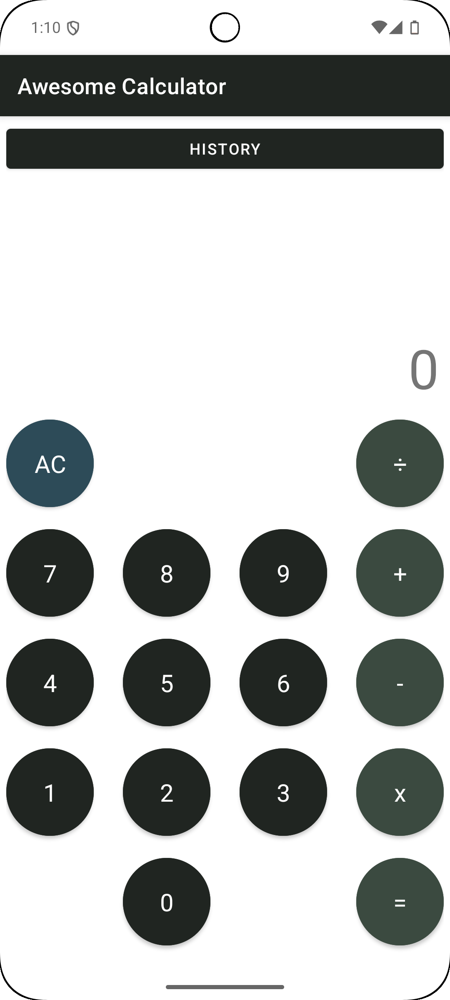
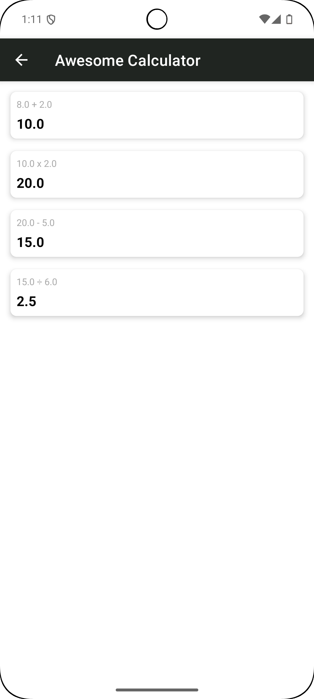

# EXAMEN ANDROID: Aplicación de Calculadora con Historial

Se te proporciona un proyecto Android que implementa una calculadora básica. La lógica de las operaciones está encapsulada en la clase `Calculator`, pero la aplicación no está terminada. Tu objetivo es completar la aplicación añadiendo funcionalidad a la `MainActivity` y a la `CalculatorHistoryActivity` (se explica en detalle más adelante). Debes utilizar la lógica proporcionada y gestionar el historial de operaciones.

A continuación, un ejemplo del resultado esperado:

---

## Tiempo
Dedicaremos un máximo de 30 minutos a dudas y puesta en marcha del proyecto Android entregado. Pasado ese tiempo, el examen tendrá una duración de 3 horas.

## Herramientas Permitidas
- Uso del ordenador y conexión a Internet.
- Consultar ejercicios realizados en clase y buscar información en Internet.

## Herramientas NO Permitidas
- No está permitido usar herramientas de mensajería o similar para hablar con otras personas. Supondrá el suspenso inmediato.

---

## Objetivos

### MainActivity
- Implementar la interfaz gráfica de la calculadora, utilizando los elementos de UI necesarios.
- Implementar la lógica de interacción entre los botones de la UI de la calculadora y la clase `Calculator` para realizar las operaciones de suma, resta, multiplicación y división.
- Cada vez que el usuario realice una operación, deberá guardarse un registro de la misma en una lista temporal en memoria, utilizando la data class `OperationRecord` para almacenar los detalles de cada operación.
- Al pulsar el botón "History", la aplicación debe navegar a la actividad `CalculatorHistoryActivity`.

### CalculatorHistoryActivity
- Mostrar en un listado el historial de todas las operaciones realizadas por el usuario en una misma sesión.
- El historial deberá reflejar correctamente las operaciones realizadas en la `MainActivity` hasta el momento.
- El Toolbar debe tener un botón "Atrás" para que el usuario, al pulsarlo, vuelva a la `MainActivity`.

### Gestión de Historial
- El historial de operaciones se debe mantener durante la ejecución de la app. Sin embargo, cuando la aplicación se cierre, el historial se pierde y debe comenzar de nuevo en la siguiente ejecución.

---

## Detalles Técnicos

- **Vista de Calculadora**: Deberás diseñar la UI que contenga al menos los botones numéricos (0-9), los operadores básicos (+, -, *, ÷, =), un botón para borrar (AC), y un campo donde se muestren los resultados.
- **Listado en CalculatorHistoryActivity**: Configura un listado para mostrar el historial de operaciones. Cada fila del listado debe mostrar los operandos, el operador y el resultado de la operación.

---

## Entregables
- Un proyecto Android funcional que cumpla con los requisitos anteriores (archivo .zip).
- Explicación en el código sobre las decisiones tomadas (comentarios).

## Evaluación
- Antes de entregar el proyecto, deberás mostrar el resultado obtenido en ejecución en tu simulador. Tendrás 3 minutos para explicar tu proyecto.
- Se valorará el funcionamiento de la aplicación y el nivel de compleción de las funcionalidades.
- Se valorará la calidad del código, nombres de variables, funciones, clases, organización, etc.
- Se valorará el uso de los elementos vistos en clase.
- Se penalizará el uso de elementos innecesarios para la implementación solicitada.

## Disclaimer
- No, no se utiliza Jetpack Compose.